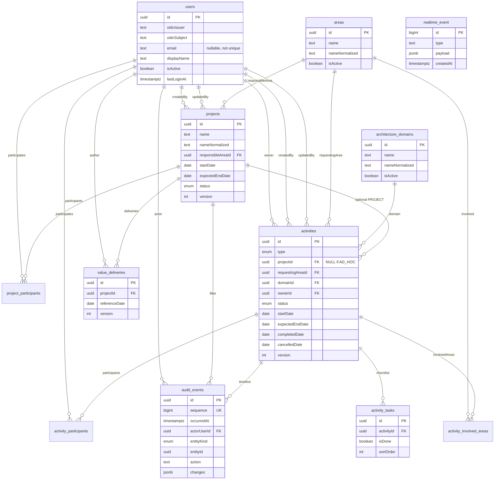

# Modelo de dados — T06

**Task:** T06  
**Status:** Contrato persistido (Prisma 7.10 + PostgreSQL 17)  
**Schema:** `prisma/schema.prisma`  
**Client gerado:** `src/generated/prisma` (`npm run db:generate`)

Este documento descreve o modelo relacional do MVP, as restrições que o Prisma não expressa sozinho e a política de ciclo de vida (inativar/cancelar em vez de excluir). Não implementa CRUD, login, auditoria transacional nem o hub SSE.

## SchemaHealth (T05) removido

A T05 criou o model placeholder `SchemaHealth` e a migration `20260910200000_t05_schema_health` só para o Prisma Migrate e o app bootarem.

A T06 **não reescreve** essa migration. A migration `20260910223000_t06_relational_model`:

1. faz `DROP TABLE "SchemaHealth"`;
2. cria enums, tabelas, FKs `ON DELETE RESTRICT`, índices, CHECKs e UNIQUE parciais.

O client gerado deixa de exportar `SchemaHealth`. Não há mais tabela de “saúde do schema”; a saúde do ambiente continua sendo o healthcheck do Compose e a subida da app.

## Diagrama ER

Datas de planejamento/execução são `DATE` (dia civil em `America/Sao_Paulo`). Instantes (`createdAt`, `updatedAt`, `occurredAt`, `lastLoginAt`) são `TIMESTAMPTZ`. Optimistic lock: `version` em `projects`, `activities` e `value_deliveries`. Checklist **não** tem `version` próprio — T15 incrementa `activities.version`.

O responsável de um projeto é o grupo virtual fixo **Arquitetura**. Esse rótulo não é uma
entidade cadastrável e não possui tabela, FK ou relacionamento próprio. A participação
individual no projeto continua sendo persistida em `project_participants`.
A migration `20260914120000_virtual_architecture_project_group` remove a FK e a coluna
legadas do responsável nominal, sem backfill ou relacionamento de compatibilidade.

`realtime_event` **não** tem FK: é efêmero (retenção 7 dias, T21/T29) e não é `audit_events`.

## Ciclo de vida: inativação vs exclusão

| Entidade | Fluxo da aplicação | Efeito |
| --- | --- | --- |
| Área | Inativar (`isActive = false`) | Referências antigas permanecem. Fora das opções de **nova** associação (T09). |
| Domínio | Inativar | Idem. |
| Projeto | Cancelar (`status = CANCELLED`) | Atividades e Entregas de Valor permanecem. Status das atividades **não** muda (RN-11). |
| Atividade | Cancelar (`status = CANCELLED`, `cancelledDate`) | RN-10; histórico preservado. |
| Usuário | `isActive = false` (T07/T09) | Histórico legível; sem novas atribuições. |
| Item de checklist | Pode ser removido (T15) | Aggregate é a atividade; auditoria não tem FK para a task. |
| `AuditEvent` | Só INSERT | Sem `updatedAt`. Nenhum fluxo de update. |
| `RealtimeEvent` | INSERT + DELETE por retenção | Cleanup **nunca** apaga auditoria. |

Não há `DELETE` de área, domínio, projeto, atividade ou usuário no fluxo normal. FKs de negócio usam **`ON DELETE RESTRICT`**: inativar uma área **não** apaga atividades. O PostgreSQL rejeitaria um `DELETE` físico enquanto houver referências.

Títulos de atividade **não** são únicos.

## Unicidade de nomes (DE-14)

Normalização de aplicação: `normalizeCatalogName(name)` = `name.trim().toLowerCase()` (espaços internos significativos; acentos distinguem). Escritores **devem** gravar esse valor em `nameNormalized`.

UNIQUE **parciais** (SQL na migration T06; o Prisma 7 não expressa `WHERE`):

| Tabela | Índice | Predicado |
| --- | --- | --- |
| `areas` | `areas_name_normalized_active_key` | `"isActive" = TRUE` |
| `architecture_domains` | `architecture_domains_name_normalized_active_key` | `"isActive" = TRUE` |
| `projects` | `projects_name_normalized_active_key` | `"status" <> 'CANCELLED'` |

Inativo/cancelado **não** bloqueia recriar o mesmo nome ativo. Dois inativos podem compartilhar a chave. Migrations futuras **não** devem dropar esses índices se `migrate diff` os marcar como “extras”.

## Outras restrições não óbvias

| Restrição | Onde | Notas |
| --- | --- | --- |
| `UNIQUE(oidcIssuer, oidcSubject)` | `users` | Identidade persistente (T07). E-mail **não** é único. |
| `users_oidc_identity_nonempty` | CHECK | issuer e subject não vazios após trim. |
| `activities_type_project_id_check` | CHECK | `PROJECT` ⇒ `projectId` NOT NULL; `AD_HOC` ⇒ `projectId` NULL. |
| `activities_completed_date_gte_start_check` | CHECK | Se `startDate` e `completedDate` existem, conclusão ≥ início (DE-13). NULL é permitido. |
| `activities_cancelled_date_gte_start_check` | CHECK | Idem para `cancelledDate` (DE-10 / DE-13). |
| Datas no futuro | **aplicação (T14)** | DE-12 (`completedDate` / `cancelledDate` > hoje) **não** é CHECK SQL. |
| `version >= 1` | Project, Activity, ValueDelivery | Optimistic lock; T12 faz `UPDATE … WHERE version = $expected`. |
| Nomes/títulos não em branco | CHECK `btrim(...) <> ''` | Área, domínio, projeto, título da atividade. |
| `AuditEvent.sequence` | `BIGSERIAL` UNIQUE | Empate de `occurredAt`: vence o **maior `sequence`** (DE-20). **Não** ordenar empate pelo UUID `id`. |
| `RealtimeEvent.id` | `BIGSERIAL` PK | Cursor SSE = este id (decimal). Índice em `createdAt` para cleanup. `type` é `TEXT`, sem enum Prisma. |
| FKs | `ON DELETE RESTRICT` | Inclusive `activities.projectId` opcional (não `SET NULL` ao apagar projeto — projeto não se apaga). |

`entityId` de auditoria é polimórfico (sem FK). `activityId` / `projectId` opcionais têm FK para filtrar timeline; preencher `activityId` também quando a entidade for `ActivityTask`.

## Enums (Prisma / PostgreSQL)

| Enum SQL | Valores | Rótulos de domínio |
| --- | --- | --- |
| `nature` | `STRATEGIC`, `OPERATIONAL` | Estratégico / Operacional |
| `architecture_role` | `RESPONSIBLE`, `CONTRIBUTOR` | Responsável / Contribuidor |
| `project_status` | `PLANNED`, `IN_PROGRESS`, `COMPLETED`, `CANCELLED` | Planejado, Em andamento, Concluído, Cancelado |
| `activity_type` | `PROJECT`, `AD_HOC` | Projeto, Ad hoc |
| `activity_status` | `BACKLOG`, `TODO`, `IN_PROGRESS`, `WAITING`, `BLOCKED`, `DONE`, `CANCELLED` | Backlog, A fazer, Em andamento, Aguardando retorno, Bloqueado, Concluído, Cancelado |
| `priority` | `LOW`, `MEDIUM`, `HIGH`, `CRITICAL` | Baixa, Média, Alta, Crítica |
| `effort` | `P`, `M`, `G` | opcional na atividade |
| `audit_entity_kind` | `User`, `Area`, `Domain`, `Project`, `Activity`, `ActivityTask`, `ValueDelivery` | `Domain` = `architecture_domains` |

Tipos TypeScript espelham esses valores em `src/domain/**` **sem** importar Prisma.

## Índices de consulta (além das uniques)

- `activities`: `status`, `ownerId`, `projectId`, `domainId`, `requestingAreaId`, `startDate`, `completedDate`
- `projects`: `status`
- `users`: `isActive`
- `areas` / `architecture_domains`: `isActive`
- `activity_tasks`: `(activityId, sortOrder)`
- `audit_events`: `(entityKind, entityId, occurredAt)`, `(activityId, occurredAt)`, `(occurredAt, sequence)`
- `realtime_event`: `(createdAt)`

## Seed

`prisma/seed.ts` chama `seedArchitectureDomains`: upsert lógico dos **seis** nomes do PRD §9 (`Arquitetura`, `Desenvolvimento e Integração`, `Dados`, `Segurança e Compliance`, `Infraestrutura e Operação`, `IA e Automação`).

- Idempotente: segunda execução não duplica (`nameNormalized`).
- Não altera `isActive` (inativação em T09 permanece).
- Não cria áreas, projetos nem usuários fictícios.

## Camada de domínio (sem Prisma)

| Módulo | Uso |
| --- | --- |
| `src/domain/catalog/normalize-catalog-name.ts` | DE-14 |
| `src/domain/catalog/architecture-domains.ts` | nomes do seed |
| `src/domain/catalog/classifications.ts` | natureza, papel, prioridade, esforço |
| `src/domain/activity/enums.ts` | tipo e status do Kanban |
| `src/domain/activity/activity-project-link.ts` | invariante type/projectId |
| `src/domain/project/project-status.ts` | status e “projeto ativo” |
| `src/domain/audit/audit-entity-kind.ts` | entityKind + ações estáveis iniciais |
| `src/domain/identity/local-user.ts` | tipo pós-guard (T07) |

## Testes

- Unitários (sempre): `normalizeCatalogName`, seis domínios, vínculo type/projectId, colunas do Kanban.
- Integração (PostgreSQL via `DATABASE_URL`): seed idempotente; UNIQUE issuer/subject e e-mail não único; CHECK type/projectId; UNIQUE parcial de área. Se o Postgres não estiver acessível, esses casos são **ignorados** (`skip`) para `npm test` passar no host sem banco.

## Encaixe T07 e T12

- **T07:** provisionar `User` por `(oidcIssuer, oidcSubject)`; e-mail nullable e não único; `isActive` default true; `lastLoginAt`; sem persistir tokens. Recusar inativo. Não fundir por e-mail.
- **T12:** gravar `AuditEvent` na mesma transação da mutação (`changes` com snapshot inicial e dimensões do retrato T02 §10.2). Ordenar timeline por `(occurredAt, sequence)`. Rejeitar `UPDATE`/`DELETE` de auditoria no fluxo da app. Optimistic lock nas três entidades com `version`; checklist sobe `Activity.version`. `RealtimeEvent` entra na mesma transação quando T21 existir; `NOTIFY` só após commit.
